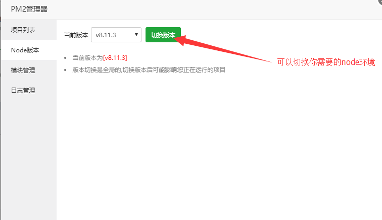
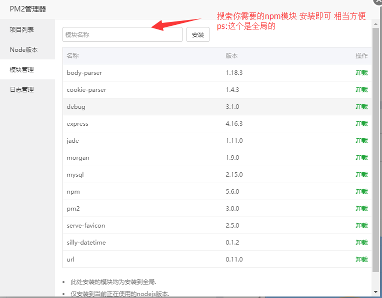

# Express_Node_xiaofang
在CentOS使用宝塔面板快速部署Express项目

### 实现步骤

> * 购置服务器 系统CentOS
> * 部署宝塔面板
> * 更改宝塔相关信息 极速安装web应用的软件，期中用到了PM2来部署Node项目

### 1.部署宝塔面板

> * ssh连接服务器后 输入：yum install -y wget && wget -O install.sh http://download.bt.cn/install/install.sh && sh install.sh 一键部署面板

### 2.极速安装web应用的软件

一开始面板会推荐你安装一些软件 直接安装即可：Nginx等等会直接安装好

因为要部署Node的项目 需要安装PM2来管理

### 3.PM2来部署Node项目

